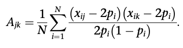
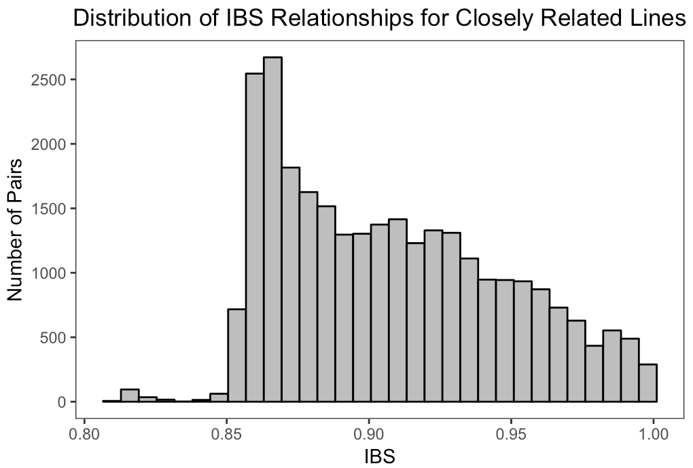
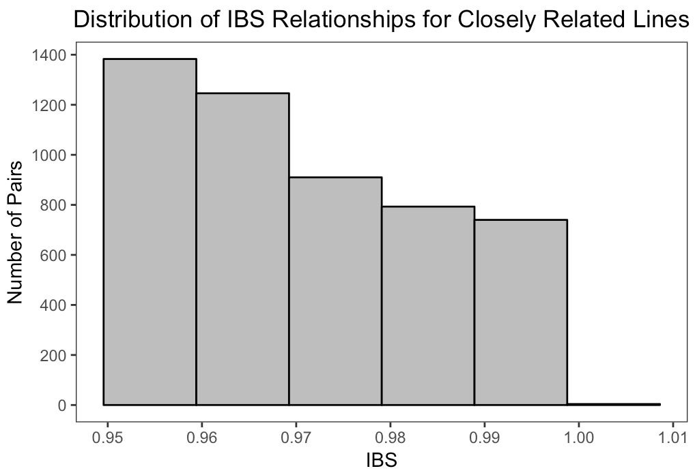
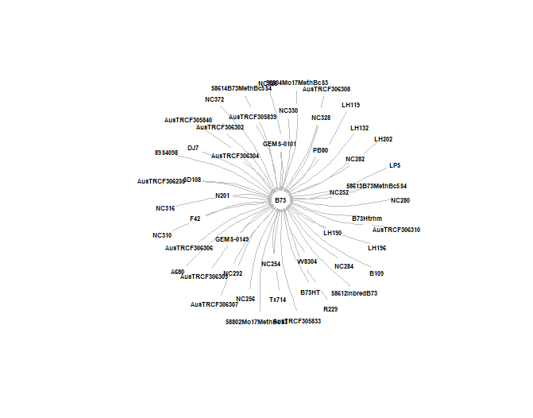
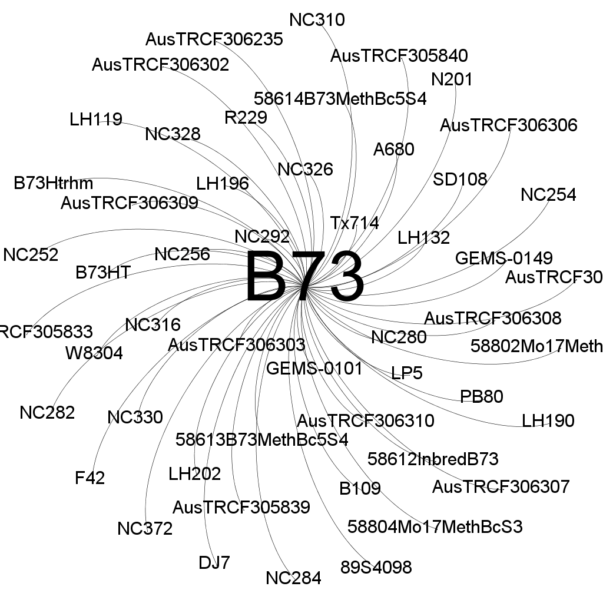

# Replication of "Comprehensive Genotyping of the USA National Maize Inbred Seed Bank" - Romay *et al.* 2013
BCB546x Fall 2018

Analysis and Replication by Iowa Captives: Daniel Kohlhase, Alejandro Ledesma, Anderson Verzegnazzi, Cassie Winn

## Background of Paper

This paper was published not long after the development of the then new sequencing procedure, Genotyping by Sequencing (GBS). GBS enables characterization of germplasm collections on a genome-wide scale and can be applied to species with high-diversity and large genomes, such as maize. Plant introduction stations around the world, such as the USDA-ARS North Central Regional Plant Introduction Station (NCRPIS) in Ames, Iowa, preserve distinct inbred lines and curate and manage these germplasm collections. Many studies have been conducted to genotypically characterize such collections, however small sample sizes may not allow the identification of all important or significant QTLs for complex traits. In this study done by Romay *et al.*, GBS was used to analyze 4,351 maize samples from 2,815 maize accessions with 681,257 SNP markers across the genome.

This paper had five objectives:

1. Compare GBS sequencing technology with other available options
2. Explore the potential of GBS to help with curation and use of germplasm
3. Evaluate genetic diversity and population structure both across the genome and between groups of germplasm
4. Investigate the history of recombination and LD through the different breeding groups
5. Explore the potential of the collection as a resource to study the genetic architecture of quantitative traits.

## Replication of Analyses & Results
### Figure 1 - Distribution of SNPs Across the Genome

The first figure of the paper involves characterizing the marker coverage by plotting the distribution of SNPs across the genome. SNPs were organized into bins that covered 1 MB windows of the genome.

The data for this figure are located and available at Panzea. The file sizes were too big to upload to Github.

When trying to recreate this figure the first challenge we ran into was loading the data file into R Studio. When we tried loading a single file containing all information from all ten chromosomes, the process took an extensive amount of time. If we were successful in loading the file, then visualizing the dataframe in R became problematic because of its size. We shortened the loading time by extracting only the columns needed to make the graph, which were the chromosome and position.

The second challenge was the SNP positions. When we tried creating the graph with the data that were given, the SNP number would be confounding because the SNP positions on different chromosomes would fall into the same 1 MB window. In order to make the bins specific for each chromosome we modified the position column so that SNP position was continuous across the entire genome.

The third challenge was the centromere positions. In the article the authors identify the centromeres on the graph by making those bins a different color. Nowhere in the article or in the data are references to the speficic positions of the centromeres. If we would have had access to these locations then the colors could have been changed in our script.

### Figure 2 - Identical by State Distribution Across GBS Samples
In Figure 2A of the paper, they show proportion of markers identical by state (IBS) as a distribution for all pairs of 2,815 lines. To calculate IBS, for all possible pairwise comparisons, they used the software PLINK (version 1.07). In the materials and methods section of the paper it states, "For each individual, the values for the nearest neighbors, based on how similar (IBS) they were, were summarized using the ‘–cluster –neighbour’ option in PLINK." Below is their figure:

We downloaded the PLINK software and tried to work with it, but it became apparent to us that there is a learning curve associated with the program. PLINK also requires that your files be in a certain format. While working with the program TASSEL to complete analysis for figure 5, we came across the function "relatedness-kinship" which computes an IBS data matrix from the genotypic data that is imported. So given the limited time we had to do the analyses, we chose to use TASSEL instead of PLINK. Upon reading more about the kinship function in TASSEL, we chose to use the option "Normalized_IBS". This equation calculates IBS using this equation: 

Our entire pipeline for this analysis included importing all raw genotypic data files (chromosomes 1 - 10) into TASSEL, using the function "Union Join" to compile these files into one, and performing the "kinship" function with the option of "Normalized_IBS" on the union joined file. The IBS matrix that was produced was then exported from TASSEL to a .csv file and imported into R to create the figure. (Unfortunately, however, the matrix .csv file is too large to upload to GitHub, so the file will need to be regenerated in TASSEL or we can find another way to provide the file.) Before creating the figure, the matrix was reformatted using the function melt() and from the R package reshape2. Then, any pairs of lines with IBS values greater than 1.0 were filtered, since the IBS matrix included IBS of lines with themselves. Next, ggplot was used to create the two histograms below. Specific comments can be found within the figure2 R code. 

One distinct difference between calculating IBS in TASSEL versus PLINK is that the IBS matrix from TASSEL includes negative values. This explains why our histogram distribution appears to be quite similar to that of the paper's figure, but that our histogram is centered around 0 rather than 0.85.

In addition to using the IBS data generated from TASSEL, we also looked at the IBS data for each line and their 10 most closely related lines which was provided in the additional material in file "Additional_File_2". Using this data instead, we created additional histograms:

### Figure 3 - B73 Network Diagram

### Figure 5 - Minor Allele Frequency Distribution and Percentage of SNPS Shared Between Maize Populations
In Figure 5 of the paper, they show both minor allele frequency distribution across all pairs of lines and the percentage of SNPs shared between maize subpopulations. In the paper they describe that: "MAF were calculated using the ‘Geno Summary by Site’ analysis tool in TASSEL (version 4.0). Taxa and site filter tools from that program were also used. To remove possible sequencing errors, only alleles detected in at least two individuals in a particular group were considered to be present for the allelic diversity calculations."

We attempted to replicate this analysis and were *partially* successful. We were able to calculate minor allele frequency using TASSEL (version 5.0). The raw imputed genotypic data was uploaded to TASSEL, and using the function 'Geno Summary by Site' we were given MAF for each SNP on each chromosome. This data was then exported as a .csv file from TASSEL and can be found in the /Data/TASSEL folder of this repository. From there, the data were read into R, where we compiled the files into one and used ggplot to graph %SNPs vs Minor Allele Frequency. As can be seen in our graph below, we got very similar results. Unfortunately, however, we were not able to complete the second portion of the graph for multiple reasons. First, it was not made clear in the paper how they calculated the % SNPs shared between subgroups at specific minor allele frequencies. We thought they might have done it using TASSEL and the 'Geno Summary by Taxa' function, however this only provides the proportion of SNPs that are heterozygous and proportion missing for each line. Additionally, the only file the author's provided that had the subgroups listed is Additional file 1. Had we determined how to calculate % SNPs shared at a specific minor allele frequency, we would then need to match each inbred line to their corresponding subgroups. Lastly, this data is very large with 681,257 SNPs across 10 chromosomes and 2,815 accessions so comparing the % of SNPs shared is computationally difficult.

### Genome-Wide Association Studies

