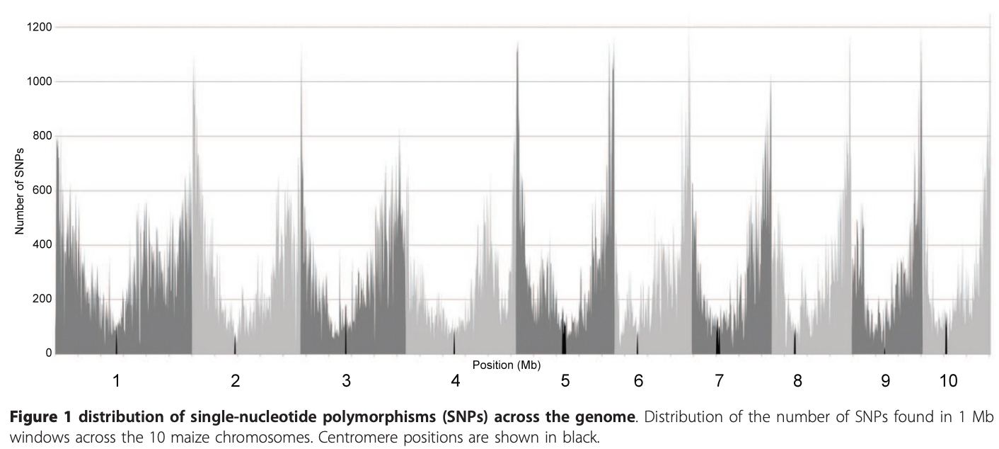
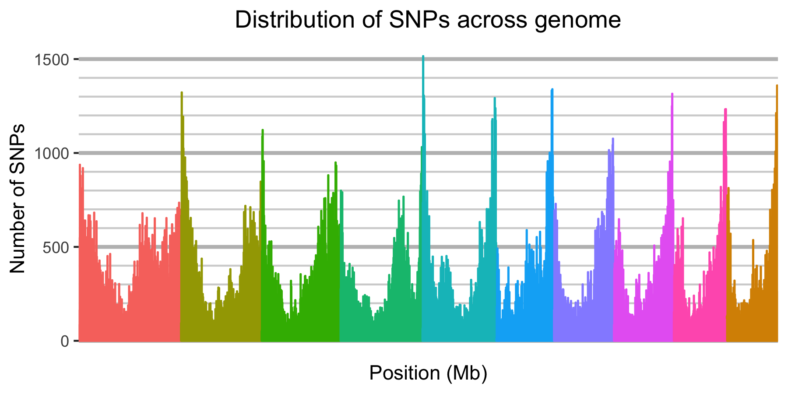
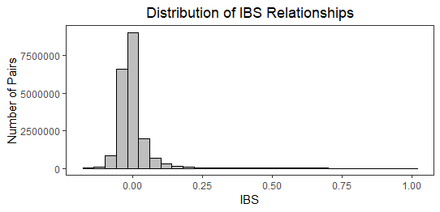
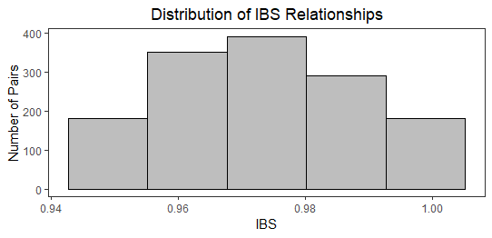
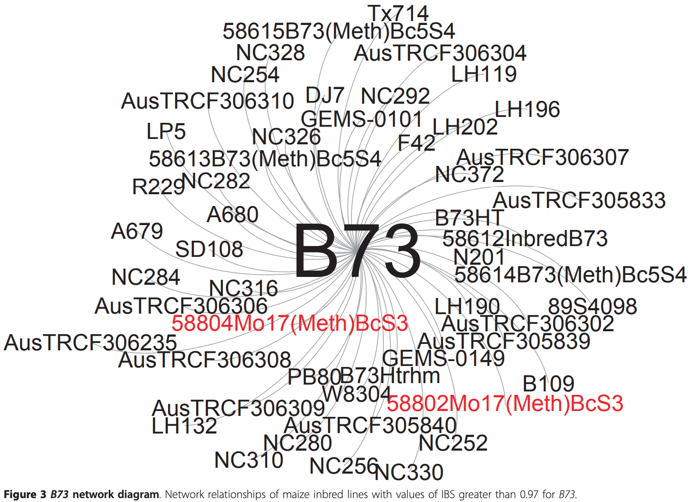
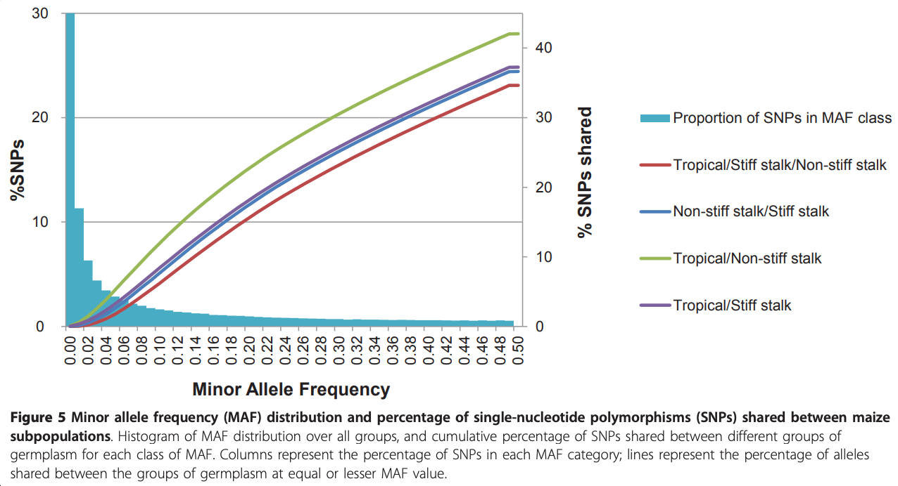
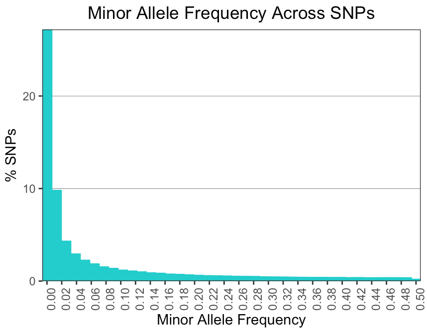

# Replication of "Comprehensive Genotyping of the USA National Maize Inbred Seed Bank" - Romay *et al.* 2013
BCB546x Fall 2018

Analysis and Replication by Iowa Captives: Daniel Kohlhase, Alejandro Ledesma, Anderson Verzegnazzi, Cassie Winn

## Background of paper

This paper was published not long after the development of the then new sequencing procedure, Genotyping by Sequencing (GBS). GBS enables characterization of germplasm collections on a genome-wide scale and can be applied to species with high-diversity and large genomes, such as maize. Plant introduction stations around the world, such as the USDA-ARS North Central Regional Plant Introduction Station (NCRPIS) in Ames, Iowa, preserve distinct inbred lines and curate and manage these germplasm collections. Many studies have been conducted to genotypically characterize such collections, however small sample sizes may not allow the identification of all important or significant QTLs for complex traits. In this study done by Romay *et al.*, GBS was used to analyze 4,351 maize samples from 2,815 maize accessions with 681,257 SNP markers across the genome.

This paper had five objectives:

1. Compare GBS sequencing technology with other available options
2. Explore the potential of GBS to help with curation and use of germplasm
3. Evaluate genetic diversity and population structure both across the genome and between groups of germplasm
4. Investigate the history of recombination and LD through the different breeding groups
5. Explore the potential of the collection as a resource to study the genetic architecture of quantitative traits.

## Replication of Analyses & Results
### Figure 1 - Distribution of SNPs Across the Genome
The first figure of the paper invovles characterizing the marker coverage by plotting the distribution of SNPs across the genome. SNPs were organized into bins that covered 1 MB. 

The data for this figure are located at Panzea. The first issue we ran into was loading the data file into R Studio. When we tried to load the entire file the process took an extensive amount of time. If we were successful in loading the file, then visualizing the dataframe in R was  In order to create a graph that fell on a single x-axis a new position column that was continuous across the entrire genome rather than positions that restarted for every chromosome

### Figure 2 - Identical by State Distribution Across GBS Samples

### Figure 3 - B73 Network Diagram

### Figure 5 - Minor Allele Frequency Distribution and Percentage of SNPS Shared Between Maize Populations
In Figure 5 of the paper, they show both minor allele frequency distribution across all pairs of lines and the percentage of SNPs shared between maize subpopulations. In the paper they describe that: "MAF were calculated using the ‘Geno Summary by Site’ analysis tool in TASSEL (version 4.0). Taxa and site filter tools from that program were also used. To remove possible sequencing errors, only alleles detected in at least two individuals in a particular group were considered to be present for the allelic diversity calculations."

We attempted to replicate this analysis and were *partially* successful. We were able to calculate minor allele frequency using TASSEL (version 5.0). The raw imputed genotypic data was uploaded to TASSEL, and using the function 'Geno Summary by Site' we were given MAF for each SNP on each chromosome. This data was then exported as a .csv file from TASSEL and can be found in the /Data/TASSEL folder of this repository. From there, the data were read into R, where we compiled the files into one and used ggplot to graph %SNPs vs Minor Allele Frequency. As can be seen in our graph below, we got very similar results. Unfortunately, however, we were not able to complete the second portion of the graph for multiple reasons. First, it was not made clear in the paper how they calculated the % SNPs shared between subgroups at specific minor allele frequencies. We thought they might have done it using TASSEL and the 'Geno Summary by Taxa' function, however this only provides the proportion of SNPs that are heterozygous and proportion missing for each line. Additionally, the only file the author's provided that had the subgroups listed is Additional file 1. Had we determined how to calculate % SNPs shared at a specific minor allele frequency, we would then need to match each inbred line to their corresponding subgroups. Lastly, this data is very large with 681,257 SNPs across 10 chromosomes and 2,815 accessions so comparing the % of SNPs shared is computationally difficult.

### Genome-Wide Association Studies

